<h1>hFOB 1.19 Kinnex single-cell long-read: day 4 vs day 0</h1>

PacBio Kinnex (10x 3′ v3.x) on hFOB 1.19 osteoblasts, one library per time point. Generated 2026-10-09.

<a href="#summary">Summary</a> · <a href="#methods">Methods</a> · <a href="#qc">Read QC</a> · <a href="#cells">Cells</a> · <a href="#subpops">Subpopulations</a> · <a href="#de">Expression</a> · <a href="#events">Events</a> · <a href="#biology">Known biology</a> · <a href="#caveats">Caveats</a>

<h2 id="summary">Summary</h2>
<ul>
<li>16,180 cells (10,258 day 0, 5,939 day 4) from SMRT Link; 15,718 pass QC. One joint isoform set across both days (isoseq collapse + pigeon): 1.28M filtered isoforms.</li>
<li>cDNA reads are short (median ~530 nt) and 40% of reads are removed by pigeon (mostly intra-priming). Coverage is slightly 5′-biased: molecules reach the TSS but many 3′ ends fall early.</li>
<li>Days separate completely in gene expression, isoform expression and isoform usage space.</li>
<li>Day 4 shows p53 reactivation (CDKN1A, MDM2, GDF15), proliferation arrest, a modest early osteoblast program (ALPL, SPP1, COL1A2, POSTN) and loss of the cold-inducible RBM3. This matches inactivation of the temperature-sensitive SV40 large T at 39.5 °C plus early differentiation.</li>
<li>Isoform-level changes with known biology: temperature-dependent CIRBP 3′ processing, SR-protein autoregulatory exons, histone mRNA polyadenylation at cell-cycle exit, tropomyosin / caldesmon isoform switches, and a near-complete RPS24 alternative-exon switch.</li>
</ul>

<h2 id="methods">Methods</h2>
<ol>
<li>Real-cell reads from each SMRT Link mapped BAM (pbmm2, hg38) were renamed with a sample prefix on read and cell barcode, merged, and collapsed jointly with <code>isoseq collapse</code>. Isoforms were classified with <code>pigeon classify</code> (GENCODE v39, refTSS v3.3 CAGE peaks, polyA motifs) and filtered with <code>pigeon filter</code> (intra-priming, RT switching, junction support).</li>
<li>Counts: each read is one UMI-deduplicated molecule; cell × isoform counts come from read → cell barcode and read → isoform; gene counts sum isoforms of each associated gene.</li>
<li>Cells: per-sample 3-MAD filters on log UMIs, log genes (low) and mitochondrial percent (high). scanpy normalisation, seurat_v3 HVGs, PCA, UMAP and Leiden in three spaces. Isoform usage features are per-cell isoform/gene proportions centred on the pooled usage, for multi-isoform genes detected in ≥ 20% of cells.</li>
<li>Events: SUPPA2 local events (SE, A5, A3, MX, RI, AF, AL) on isoforms with ≥ 10 reads; TSS (50 nt) and 3′ end (100 nt) clusters per gene. Detected = ≥ 20 pooled reads with PSI in [0.05, 0.95].</li>
<li>Differential usage: quasi-binomial GLM with day as the only covariate, cells as observations (closed form, Pearson dispersion floored at 1), BH FDR &lt; 0.05 and |ΔPSI| ≥ 0.1. satuRn was run on the isoform set as a check.</li>
<li>Gene DE: cell-level Wilcoxon with pseudobulk log2 CPM fold change (FDR &lt; 0.05, |log2FC| ≥ 0.5, detected in ≥ 10% of cells). GSEA prerank on pseudobulk log2FC (MSigDB Hallmark, GO BP).</li>
</ol>

<h2 id="qc">Read QC</h2>

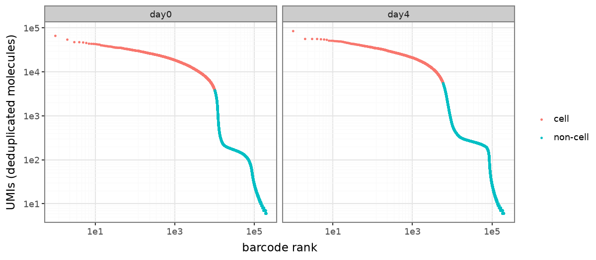 <em>Barcode-rank plots. Red: barcodes called as cells by SMRT Link.</em>

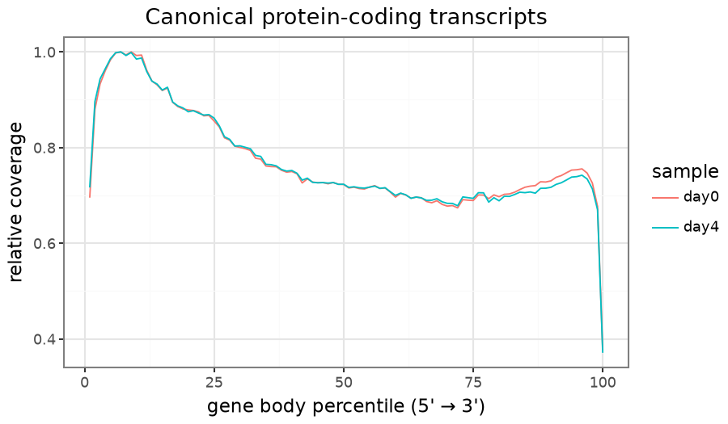 <em>RSeQC gene-body coverage on canonical protein-coding transcripts (2% of reads).</em>

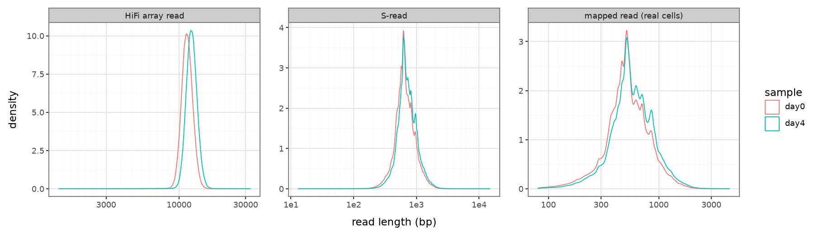 <em>Read lengths: HiFi array reads (Kinnex concatemers), segmented S-reads, and deduplicated mapped reads from real cells.</em>

<table class="dataframe tbl">
  <thead>
    <tr style="text-align: right;">
      <th>type</th>
      <th>sample</th>
      <th>10%</th>
      <th>50%</th>
      <th>90%</th>
    </tr>
  </thead>
  <tbody>
    <tr>
      <td>HiFi array read</td>
      <td>day0</td>
      <td>10189.0</td>
      <td>11404.0</td>
      <td>12849.0</td>
    </tr>
    <tr>
      <td>HiFi array read</td>
      <td>day4</td>
      <td>10995.0</td>
      <td>12280.0</td>
      <td>13794.0</td>
    </tr>
    <tr>
      <td>S-read</td>
      <td>day0</td>
      <td>438.0</td>
      <td>642.0</td>
      <td>1023.0</td>
    </tr>
    <tr>
      <td>S-read</td>
      <td>day4</td>
      <td>479.0</td>
      <td>692.0</td>
      <td>1093.0</td>
    </tr>
    <tr>
      <td>mapped read (real cells)</td>
      <td>day0</td>
      <td>300.0</td>
      <td>515.0</td>
      <td>892.0</td>
    </tr>
    <tr>
      <td>mapped read (real cells)</td>
      <td>day4</td>
      <td>337.0</td>
      <td>556.0</td>
      <td>971.0</td>
    </tr>
  </tbody>
</table>

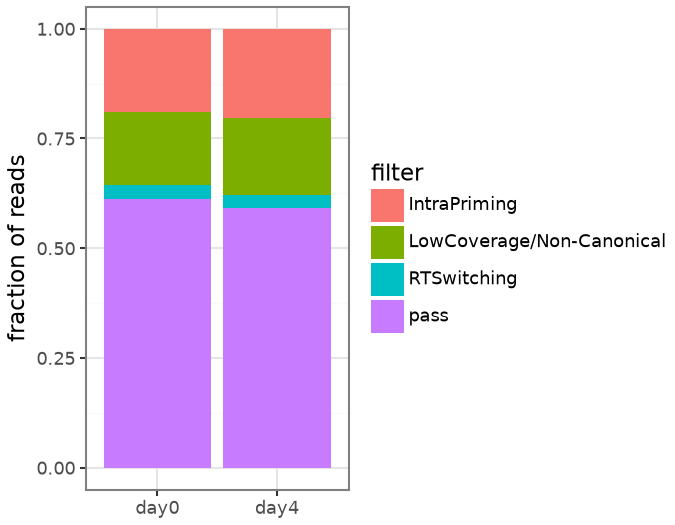 <em>Per-read pigeon filter outcome (QC-pass cells).</em>

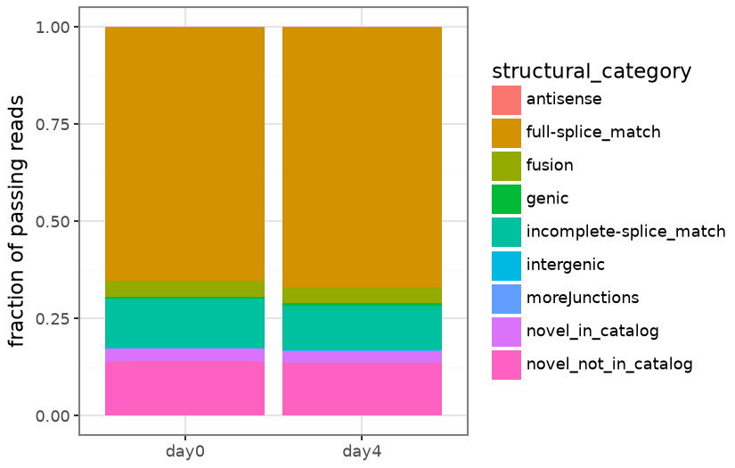 <em>Structural category of passing reads.</em>

Kit: 10x 3′ v3.x (12 bp UMI; 100% of called cell barcodes are in the 3′ v3 whitelist, ~1% in the 5′ whitelist). With long reads the whole molecule is sequenced, so coverage reflects where molecules start (RT reaching the cap) and end (oligo-dT priming site), not the kit's barcode end.

Among passing reads assigned to known transcripts, 5′-fragments (missing 3′ exons) are 8.5% / 7.3% and 3′-fragments (missing 5′ exons) 3.0% (day 0 / day 4). The mild 5′-high coverage therefore reflects early 3′ ends (residual internal priming, proximal polyA sites upstream of long annotated UTRs) rather than RT truncation.

<h2 id="cells">Cells and embeddings</h2>
<table class="dataframe tbl">
  <thead>
    <tr style="text-align: right;">
      <th>sample</th>
      <th>cells</th>
      <th>cells_pass</th>
      <th>median_umis</th>
      <th>median_genes</th>
      <th>median_isoforms</th>
      <th>median_pct_mt</th>
    </tr>
  </thead>
  <tbody>
    <tr>
      <td>day0</td>
      <td>10248</td>
      <td>10065</td>
      <td>5106.0</td>
      <td>1843.0</td>
      <td>2300.5</td>
      <td>0.743</td>
    </tr>
    <tr>
      <td>day4</td>
      <td>5932</td>
      <td>5653</td>
      <td>6814.5</td>
      <td>2257.0</td>
      <td>2886.5</td>
      <td>0.486</td>
    </tr>
  </tbody>
</table>

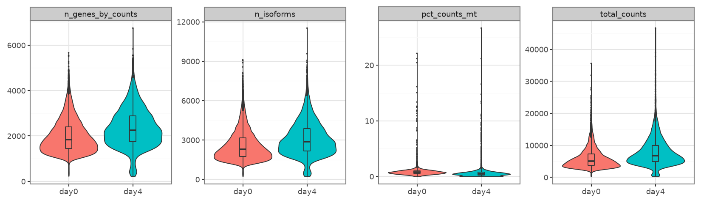 <em>Per-cell UMIs, genes, isoforms and mitochondrial percent (counts after pigeon filtering).</em>

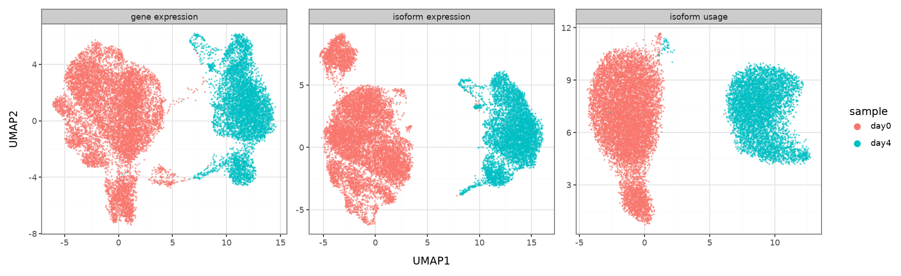 <em>UMAPs on gene expression, isoform expression and isoform usage, coloured by day.</em>

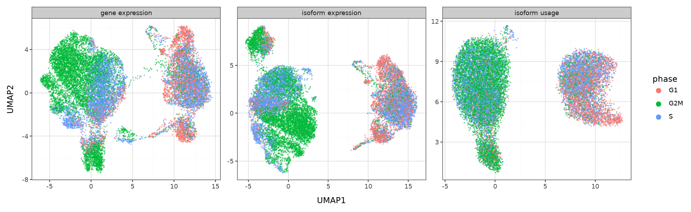 <em>Cell-cycle phase (Seurat 2019 S/G2M genes). Day 0: 62% G2M; day 4: 46% G1.</em>

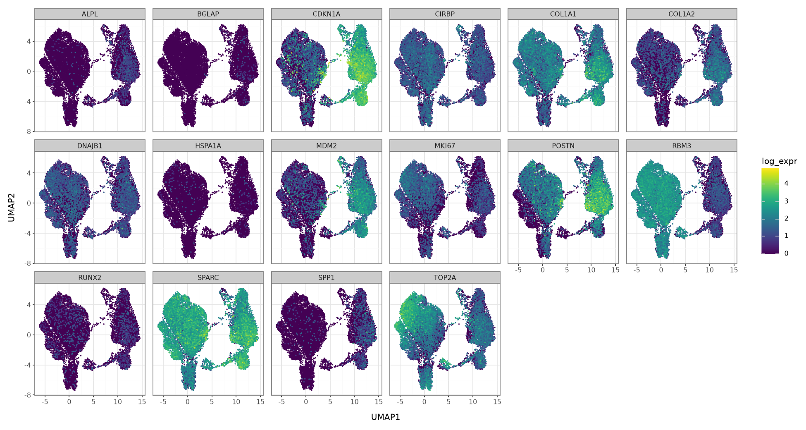 <em>Marker genes on the gene-expression UMAP (log-normalised).</em>

<h2 id="subpops">Subpopulations</h2>

Leiden clusters on the gene-expression graph (all cells, resolution 0.5) were annotated with within-day one-vs-rest Wilcoxon markers (excluding ribosomal, mitochondrial and unannotated genes), Hallmark over-representation of the top 150 markers, cell-cycle phase, and curated state scores (scanpy score_genes).

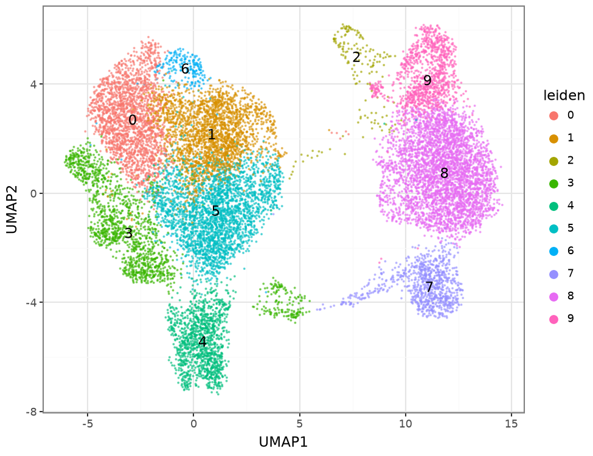 <em>Leiden clusters on the gene-expression UMAP.</em>

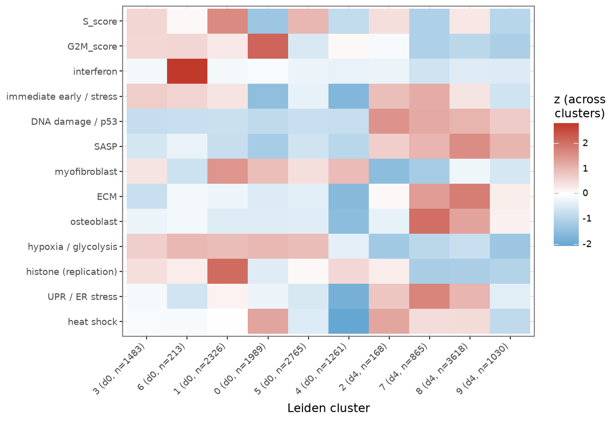 <em>Mean state scores per cluster, z-scored across clusters.</em>

<table class="dataframe tbl">
  <thead>
    <tr style="text-align: right;">
      <th>leiden</th>
      <th>day</th>
      <th>label</th>
      <th>n</th>
      <th>frac_day4</th>
      <th>umis</th>
      <th>genes</th>
      <th>frac_G1</th>
      <th>frac_S</th>
      <th>frac_G2M</th>
      <th>markers (top 10)</th>
      <th>hallmark_ORA</th>
    </tr>
  </thead>
  <tbody>
    <tr>
      <td>0</td>
      <td>day 0</td>
      <td>cycling G2/M</td>
      <td>1989</td>
      <td>0.00</td>
      <td>6537</td>
      <td>2295</td>
      <td>0.00</td>
      <td>0.00</td>
      <td>1.00</td>
      <td>ARL6IP1, CKS2, CENPF, CCNB1, TOP2A, TPX2, ASPM, PRC1, AURKA, UBE2S</td>
      <td>G2-M Checkpoint (1e-56); E2F Targets (2e-29); Mitotic Spindle (2e-24); Spermatogenesis (7e-07)</td>
    </tr>
    <tr>
      <td>1</td>
      <td>day 0</td>
      <td>cycling S/G2, histone-high</td>
      <td>2326</td>
      <td>0.00</td>
      <td>5412</td>
      <td>2043</td>
      <td>0.01</td>
      <td>0.38</td>
      <td>0.60</td>
      <td>H4C3, H1-2, H2AC14, H1-5, H1-3, H1-4, H1-1, MTHFD2, H2AC17, ATAD2</td>
      <td>E2F Targets (2e-18); Epithelial Mesenchymal Transition (2e-09); G2-M Checkpoint (4e-07); mTORC1 Signaling (4e-05)</td>
    </tr>
    <tr>
      <td>3</td>
      <td>day 0</td>
      <td>mesenchymal / EMT-high</td>
      <td>1483</td>
      <td>0.00</td>
      <td>7007</td>
      <td>2330</td>
      <td>0.04</td>
      <td>0.35</td>
      <td>0.61</td>
      <td>TMSB4X, VIM, MALAT1, ITGB1, VAMP5, TUBA1A, ASB5, LOXL2, CRNDE, PLK2</td>
      <td>Epithelial Mesenchymal Transition (2e-06); Myogenesis (2e-04); Coagulation (3e-03); Apical Junction (2e-02)</td>
    </tr>
    <tr>
      <td>4</td>
      <td>day 0</td>
      <td>low-complexity, ribosome/OXPHOS-high</td>
      <td>1261</td>
      <td>0.00</td>
      <td>4126</td>
      <td>1325</td>
      <td>0.15</td>
      <td>0.14</td>
      <td>0.71</td>
      <td>SEC61G, MYL6, HINT1, H2AZ1, BTF3, TXN, FTH1, FAU, NME2, SEC61B</td>
      <td>Oxidative Phosphorylation (5e-19); Myc Targets V1 (6e-05); Reactive Oxygen Species Pathway (8e-03); G2-M Checkpoint (2e-02)</td>
    </tr>
    <tr>
      <td>5</td>
      <td>day 0</td>
      <td>cycling G1/S</td>
      <td>2765</td>
      <td>0.00</td>
      <td>3868</td>
      <td>1522</td>
      <td>0.14</td>
      <td>0.53</td>
      <td>0.33</td>
      <td>KRT8, SNHG19, MEST, SLBP, MSH6, UNG, CDCA7, MCM6, ADAMTS1, SNHG18</td>
      <td>Androgen Response (2e-02); E2F Targets (2e-02)</td>
    </tr>
    <tr>
      <td>6</td>
      <td>day 0</td>
      <td>interferon response</td>
      <td>213</td>
      <td>0.00</td>
      <td>5877</td>
      <td>2097</td>
      <td>0.07</td>
      <td>0.29</td>
      <td>0.64</td>
      <td>ISG15, IFIT3, IFIT2, OASL, IFIT1, DDX58, HERC5, PMAIP1, PRSS23, ISG20</td>
      <td>Interferon Gamma Response (5e-39); Interferon Alpha Response (9e-39); Inflammatory Response (5e-06); TNF-alpha Signaling via NF-kB (7e-06)</td>
    </tr>
    <tr>
      <td>2</td>
      <td>day 4</td>
      <td>stress / DNA damage (mixed day)</td>
      <td>168</td>
      <td>0.85</td>
      <td>4799</td>
      <td>1863</td>
      <td>0.18</td>
      <td>0.36</td>
      <td>0.45</td>
      <td>GADD45A, SNHG12, ZFAS1, LINC01704, MIR7-3HG, LGALS7B, PTTG1, H2AC18, CDKN3, H1-2</td>
      <td>p53 Pathway (7e-07); TNF-alpha Signaling via NF-kB (2e-02)</td>
    </tr>
    <tr>
      <td>7</td>
      <td>day 4</td>
      <td>mesenchymal, osteoblast-high</td>
      <td>865</td>
      <td>0.99</td>
      <td>9649</td>
      <td>2948</td>
      <td>0.62</td>
      <td>0.26</td>
      <td>0.12</td>
      <td>TMSB4X, VIM, VAMP5, ITGB1, LY96, SPARC, ASB5, KRT17, NTM, ID3</td>
      <td>Epithelial Mesenchymal Transition (2e-08); Myogenesis (9e-04); UV Response Dn (9e-04); Complement (1e-02)</td>
    </tr>
    <tr>
      <td>8</td>
      <td>day 4</td>
      <td>ECM-producing, S/G1-arrested</td>
      <td>3618</td>
      <td>1.00</td>
      <td>6866</td>
      <td>2305</td>
      <td>0.37</td>
      <td>0.51</td>
      <td>0.12</td>
      <td>POSTN, APLP2, PABPC1, COL4A1, INHBA, FN1, CLDN11, SERPINE2, LMCD1, THBS1</td>
      <td>Epithelial Mesenchymal Transition (2e-16); E2F Targets (8e-10); Angiogenesis (8e-06); Hypoxia (6e-04)</td>
    </tr>
    <tr>
      <td>9</td>
      <td>day 4</td>
      <td>low-complexity, ribosome/OXPHOS-high</td>
      <td>1030</td>
      <td>1.00</td>
      <td>5983</td>
      <td>1797</td>
      <td>0.70</td>
      <td>0.23</td>
      <td>0.07</td>
      <td>SNHG29, SEC61G, BTF3, HINT1, MYL6, TXN, NACA, SRP14, S100A6, OSTC</td>
      <td>Oxidative Phosphorylation (8e-17); Myc Targets V1 (9e-04); Reactive Oxygen Species Pathway (9e-04); DNA Repair (2e-02)</td>
    </tr>
  </tbody>
</table>

Day 0 subclusters are mainly cell-cycle phases (G1/S, S/G2 with histone mRNAs, G2/M), plus a mesenchymal / EMT-high group, a small interferon-response group (213 cells) and a low-complexity ribosome/OXPHOS-high group. Day 4 has an ECM-producing majority (POSTN, FN1, COL4A1, INHBA), a mesenchymal group with the highest osteoblast score (SPARC, COL1A1), a low-complexity group matching day 0 cluster 4, and a small p53/stress group (GADD45A, PLK2, AREG) that includes 26 day 0 cells. Part of day 0 cluster 3 bridges toward day 4 cluster 7, suggesting a day 0 subset already resembling the day 4 mesenchymal state. The two low-complexity clusters (fewest genes and UMIs, short housekeeping transcripts) may be smaller or lower-quality cells rather than a distinct biological state.

<h3>Are the clusters statistically supported? sc-SHC</h3>

sc-SHC (Grabski, Street &amp; Irizarry 2023, Nat Methods) tests each split of a cluster hierarchy against a null of a single population (Gaussian-copula model of the counts fitted to the merged cells), controlling the family-wise error rate (α = 0.05). It was run per day on raw gene counts (2,500 features, 30 PCs): <code>testClusters</code> on the Leiden labels (clusters with ≥ 20 cells in that day), which merges clusters that are not significantly different, and <code>scSHC</code> for de novo significance-based clustering.

sc-SHC results not yet available.

<h2 id="de">Differential expression, day 4 vs day 0</h2>

1,501 genes up and 1,553 down.

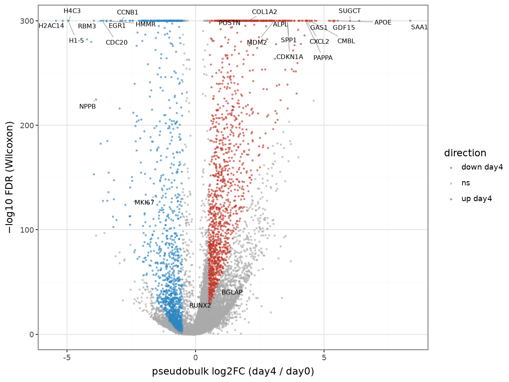 <em>Volcano: pseudobulk log2FC vs cell-level Wilcoxon FDR (capped at 1e-300).</em>

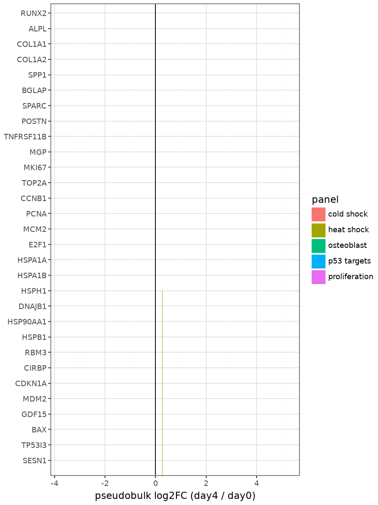 <em>Marker panels: osteoblast, proliferation, heat shock, cold shock, p53 targets.</em>

<table class="dataframe tbl">
  <thead>
    <tr style="text-align: right;">
      <th>panel</th>
      <th>gene</th>
      <th>pb_log2FC</th>
      <th>pvals_adj</th>
      <th>cpm_day0</th>
      <th>cpm_day4</th>
      <th>pct_day0</th>
      <th>pct_day4</th>
    </tr>
  </thead>
  <tbody>
    <tr>
      <td>osteoblast</td>
      <td>RUNX2</td>
      <td>0.661</td>
      <td>0.000</td>
      <td>9.605</td>
      <td>15.769</td>
      <td>0.053</td>
      <td>0.109</td>
    </tr>
    <tr>
      <td>osteoblast</td>
      <td>ALPL</td>
      <td>3.491</td>
      <td>0.000</td>
      <td>1.469</td>
      <td>26.752</td>
      <td>0.008</td>
      <td>0.169</td>
    </tr>
    <tr>
      <td>osteoblast</td>
      <td>COL1A1</td>
      <td>0.821</td>
      <td>0.000</td>
      <td>317.919</td>
      <td>562.384</td>
      <td>0.661</td>
      <td>0.825</td>
    </tr>
    <tr>
      <td>osteoblast</td>
      <td>COL1A2</td>
      <td>2.053</td>
      <td>0.000</td>
      <td>42.743</td>
      <td>180.480</td>
      <td>0.183</td>
      <td>0.599</td>
    </tr>
    <tr>
      <td>osteoblast</td>
      <td>SPP1</td>
      <td>3.578</td>
      <td>0.000</td>
      <td>2.525</td>
      <td>41.107</td>
      <td>0.014</td>
      <td>0.197</td>
    </tr>
    <tr>
      <td>osteoblast</td>
      <td>BGLAP</td>
      <td>1.864</td>
      <td>0.000</td>
      <td>0.165</td>
      <td>3.241</td>
      <td>0.001</td>
      <td>0.024</td>
    </tr>
    <tr>
      <td>osteoblast</td>
      <td>SPARC</td>
      <td>0.327</td>
      <td>0.000</td>
      <td>993.414</td>
      <td>1246.305</td>
      <td>0.916</td>
      <td>0.953</td>
    </tr>
    <tr>
      <td>osteoblast</td>
      <td>POSTN</td>
      <td>1.972</td>
      <td>0.000</td>
      <td>209.542</td>
      <td>824.947</td>
      <td>0.423</td>
      <td>0.828</td>
    </tr>
    <tr>
      <td>osteoblast</td>
      <td>TNFRSF11B</td>
      <td>0.692</td>
      <td>0.000</td>
      <td>7.146</td>
      <td>12.158</td>
      <td>0.036</td>
      <td>0.076</td>
    </tr>
    <tr>
      <td>osteoblast</td>
      <td>MGP</td>
      <td>0.910</td>
      <td>0.000</td>
      <td>0.528</td>
      <td>1.870</td>
      <td>0.002</td>
      <td>0.010</td>
    </tr>
    <tr>
      <td>proliferation</td>
      <td>MKI67</td>
      <td>-1.550</td>
      <td>0.000</td>
      <td>110.489</td>
      <td>37.083</td>
      <td>0.385</td>
      <td>0.221</td>
    </tr>
    <tr>
      <td>proliferation</td>
      <td>TOP2A</td>
      <td>-1.776</td>
      <td>0.000</td>
      <td>635.260</td>
      <td>184.808</td>
      <td>0.684</td>
      <td>0.603</td>
    </tr>
    <tr>
      <td>proliferation</td>
      <td>CCNB1</td>
      <td>-2.886</td>
      <td>0.000</td>
      <td>351.652</td>
      <td>46.718</td>
      <td>0.596</td>
      <td>0.266</td>
    </tr>
    <tr>
      <td>proliferation</td>
      <td>PCNA</td>
      <td>0.926</td>
      <td>0.000</td>
      <td>189.870</td>
      <td>361.568</td>
      <td>0.545</td>
      <td>0.835</td>
    </tr>
    <tr>
      <td>proliferation</td>
      <td>MCM2</td>
      <td>-0.650</td>
      <td>0.000</td>
      <td>46.160</td>
      <td>29.058</td>
      <td>0.219</td>
      <td>0.200</td>
    </tr>
    <tr>
      <td>proliferation</td>
      <td>E2F1</td>
      <td>-0.660</td>
      <td>0.026</td>
      <td>2.608</td>
      <td>1.283</td>
      <td>0.015</td>
      <td>0.010</td>
    </tr>
    <tr>
      <td>heat shock</td>
      <td>HSPA1A</td>
      <td>-0.019</td>
      <td>0.044</td>
      <td>1.997</td>
      <td>1.957</td>
      <td>0.011</td>
      <td>0.015</td>
    </tr>
    <tr>
      <td>heat shock</td>
      <td>HSPA1B</td>
      <td>-0.436</td>
      <td>0.001</td>
      <td>44.889</td>
      <td>32.929</td>
      <td>0.202</td>
      <td>0.187</td>
    </tr>
    <tr>
      <td>heat shock</td>
      <td>HSPH1</td>
      <td>0.269</td>
      <td>0.000</td>
      <td>118.890</td>
      <td>143.440</td>
      <td>0.432</td>
      <td>0.578</td>
    </tr>
    <tr>
      <td>heat shock</td>
      <td>DNAJB1</td>
      <td>-0.020</td>
      <td>0.000</td>
      <td>78.292</td>
      <td>77.212</td>
      <td>0.327</td>
      <td>0.414</td>
    </tr>
    <tr>
      <td>heat shock</td>
      <td>HSP90AA1</td>
      <td>-0.110</td>
      <td>0.000</td>
      <td>876.076</td>
      <td>811.484</td>
      <td>0.942</td>
      <td>0.966</td>
    </tr>
    <tr>
      <td>heat shock</td>
      <td>HSPB1</td>
      <td>0.858</td>
      <td>0.000</td>
      <td>344.060</td>
      <td>624.414</td>
      <td>0.805</td>
      <td>0.958</td>
    </tr>
    <tr>
      <td>cold shock</td>
      <td>RBM3</td>
      <td>-3.693</td>
      <td>0.000</td>
      <td>771.874</td>
      <td>58.746</td>
      <td>0.935</td>
      <td>0.338</td>
    </tr>
    <tr>
      <td>cold shock</td>
      <td>CIRBP</td>
      <td>-0.544</td>
      <td>0.000</td>
      <td>133.214</td>
      <td>91.023</td>
      <td>0.502</td>
      <td>0.460</td>
    </tr>
    <tr>
      <td>p53 targets</td>
      <td>CDKN1A</td>
      <td>3.569</td>
      <td>0.000</td>
      <td>152.606</td>
      <td>1821.956</td>
      <td>0.259</td>
      <td>0.987</td>
    </tr>
    <tr>
      <td>p53 targets</td>
      <td>MDM2</td>
      <td>3.064</td>
      <td>0.000</td>
      <td>51.639</td>
      <td>439.280</td>
      <td>0.143</td>
      <td>0.833</td>
    </tr>
    <tr>
      <td>p53 targets</td>
      <td>GDF15</td>
      <td>5.254</td>
      <td>0.000</td>
      <td>18.649</td>
      <td>748.736</td>
      <td>0.046</td>
      <td>0.913</td>
    </tr>
    <tr>
      <td>p53 targets</td>
      <td>BAX</td>
      <td>1.923</td>
      <td>0.000</td>
      <td>126.415</td>
      <td>482.258</td>
      <td>0.485</td>
      <td>0.926</td>
    </tr>
    <tr>
      <td>p53 targets</td>
      <td>TP53I3</td>
      <td>3.638</td>
      <td>0.000</td>
      <td>13.252</td>
      <td>176.391</td>
      <td>0.070</td>
      <td>0.635</td>
    </tr>
    <tr>
      <td>p53 targets</td>
      <td>SESN1</td>
      <td>2.604</td>
      <td>0.000</td>
      <td>3.680</td>
      <td>27.448</td>
      <td>0.020</td>
      <td>0.182</td>
    </tr>
  </tbody>
</table>
<h3>Hallmark GSEA (FDR &lt; 0.05)</h3>
<table class="dataframe tbl">
  <thead>
    <tr style="text-align: right;">
      <th>Term</th>
      <th>NES</th>
      <th>FDR q-val</th>
    </tr>
  </thead>
  <tbody>
    <tr>
      <td>p53 Pathway</td>
      <td>2.587</td>
      <td>0.000</td>
    </tr>
    <tr>
      <td>Epithelial Mesenchymal Transition</td>
      <td>2.452</td>
      <td>0.000</td>
    </tr>
    <tr>
      <td>TNF-alpha Signaling via NF-kB</td>
      <td>2.271</td>
      <td>0.000</td>
    </tr>
    <tr>
      <td>KRAS Signaling Up</td>
      <td>2.158</td>
      <td>0.000</td>
    </tr>
    <tr>
      <td>Apoptosis</td>
      <td>2.118</td>
      <td>0.000</td>
    </tr>
    <tr>
      <td>IL-6/JAK/STAT3 Signaling</td>
      <td>2.096</td>
      <td>0.000</td>
    </tr>
    <tr>
      <td>Inflammatory Response</td>
      <td>2.076</td>
      <td>0.000</td>
    </tr>
    <tr>
      <td>Angiogenesis</td>
      <td>2.075</td>
      <td>0.000</td>
    </tr>
    <tr>
      <td>Allograft Rejection</td>
      <td>1.878</td>
      <td>0.001</td>
    </tr>
    <tr>
      <td>Coagulation</td>
      <td>1.843</td>
      <td>0.001</td>
    </tr>
    <tr>
      <td>Complement</td>
      <td>1.813</td>
      <td>0.002</td>
    </tr>
    <tr>
      <td>Hypoxia</td>
      <td>1.780</td>
      <td>0.002</td>
    </tr>
    <tr>
      <td>Myogenesis</td>
      <td>1.756</td>
      <td>0.003</td>
    </tr>
    <tr>
      <td>UV Response Dn</td>
      <td>1.752</td>
      <td>0.003</td>
    </tr>
    <tr>
      <td>IL-2/STAT5 Signaling</td>
      <td>1.695</td>
      <td>0.005</td>
    </tr>
    <tr>
      <td>KRAS Signaling Dn</td>
      <td>1.646</td>
      <td>0.008</td>
    </tr>
    <tr>
      <td>Cholesterol Homeostasis</td>
      <td>1.608</td>
      <td>0.011</td>
    </tr>
    <tr>
      <td>Hedgehog Signaling</td>
      <td>1.575</td>
      <td>0.015</td>
    </tr>
    <tr>
      <td>Apical Surface</td>
      <td>1.563</td>
      <td>0.016</td>
    </tr>
    <tr>
      <td>Interferon Gamma Response</td>
      <td>1.513</td>
      <td>0.027</td>
    </tr>
    <tr>
      <td>Xenobiotic Metabolism</td>
      <td>1.498</td>
      <td>0.029</td>
    </tr>
    <tr>
      <td>Estrogen Response Early</td>
      <td>1.456</td>
      <td>0.041</td>
    </tr>
    <tr>
      <td>Apical Junction</td>
      <td>1.456</td>
      <td>0.039</td>
    </tr>
    <tr>
      <td>Spermatogenesis</td>
      <td>-1.784</td>
      <td>0.003</td>
    </tr>
    <tr>
      <td>Myc Targets V2</td>
      <td>-2.162</td>
      <td>0.000</td>
    </tr>
    <tr>
      <td>Mitotic Spindle</td>
      <td>-2.372</td>
      <td>0.000</td>
    </tr>
    <tr>
      <td>Myc Targets V1</td>
      <td>-2.670</td>
      <td>0.000</td>
    </tr>
    <tr>
      <td>E2F Targets</td>
      <td>-2.721</td>
      <td>0.000</td>
    </tr>
    <tr>
      <td>G2-M Checkpoint</td>
      <td>-3.152</td>
      <td>0.000</td>
    </tr>
  </tbody>
</table>

<h2 id="events">Alternative isoform events</h2>
<h3>Detected events (pooled cells)</h3>
<table class="dataframe tbl">
  <thead>
    <tr style="text-align: right;">
      <th>event_type</th>
      <th>n_defined</th>
      <th>n_detected</th>
      <th>n_genes_detected</th>
    </tr>
  </thead>
  <tbody>
    <tr>
      <td>SE</td>
      <td>20022</td>
      <td>11701</td>
      <td>5126</td>
    </tr>
    <tr>
      <td>A5</td>
      <td>12399</td>
      <td>7939</td>
      <td>3274</td>
    </tr>
    <tr>
      <td>A3</td>
      <td>10667</td>
      <td>6746</td>
      <td>2994</td>
    </tr>
    <tr>
      <td>MX</td>
      <td>3882</td>
      <td>3145</td>
      <td>1340</td>
    </tr>
    <tr>
      <td>RI</td>
      <td>4842</td>
      <td>3030</td>
      <td>1478</td>
    </tr>
    <tr>
      <td>AF</td>
      <td>65910</td>
      <td>53064</td>
      <td>3754</td>
    </tr>
    <tr>
      <td>AL</td>
      <td>36534</td>
      <td>31314</td>
      <td>5004</td>
    </tr>
    <tr>
      <td>alt TSS</td>
      <td>24763</td>
      <td>8185</td>
      <td>8185</td>
    </tr>
    <tr>
      <td>alt TSS (CAGE-supported)</td>
      <td>24763</td>
      <td>895</td>
      <td>895</td>
    </tr>
    <tr>
      <td>alt TSS (distinct terminal exon)</td>
      <td>24763</td>
      <td>4423</td>
      <td>4423</td>
    </tr>
    <tr>
      <td>alt TSS (tandem, same exon)</td>
      <td>24763</td>
      <td>3435</td>
      <td>3435</td>
    </tr>
    <tr>
      <td>alt polyA</td>
      <td>24763</td>
      <td>9509</td>
      <td>9509</td>
    </tr>
    <tr>
      <td>alt polyA (polyA-signal-supported)</td>
      <td>24763</td>
      <td>3314</td>
      <td>3314</td>
    </tr>
    <tr>
      <td>alt polyA (distinct terminal exon)</td>
      <td>24763</td>
      <td>5518</td>
      <td>5518</td>
    </tr>
    <tr>
      <td>alt polyA (tandem, same exon)</td>
      <td>24763</td>
      <td>4196</td>
      <td>4196</td>
    </tr>
  </tbody>
</table>

Requiring every TSS cluster to lie in a refTSS peak reduces alternative-TSS genes from 8,185 to 895, so most raw alternative TSS calls are likely 5′-truncated molecules. SUPPA AF/AL counts are inflated by combinatorial isoform pairs; the cluster-based counts are preferred.

<h3>Differential usage (FDR &lt; 0.05, |ΔPSI| ≥ 0.1)</h3>
<table class="dataframe tbl">
  <thead>
    <tr style="text-align: right;">
      <th>test</th>
      <th>n_tested</th>
      <th>n_sig</th>
      <th>n_genes_sig</th>
    </tr>
  </thead>
  <tbody>
    <tr>
      <td>local:A3</td>
      <td>6720</td>
      <td>681</td>
      <td>516</td>
    </tr>
    <tr>
      <td>local:A5</td>
      <td>8124</td>
      <td>954</td>
      <td>647</td>
    </tr>
    <tr>
      <td>local:AF</td>
      <td>31991</td>
      <td>5877</td>
      <td>1282</td>
    </tr>
    <tr>
      <td>local:AL</td>
      <td>13890</td>
      <td>3030</td>
      <td>1095</td>
    </tr>
    <tr>
      <td>local:MX</td>
      <td>1805</td>
      <td>491</td>
      <td>309</td>
    </tr>
    <tr>
      <td>local:RI</td>
      <td>3079</td>
      <td>440</td>
      <td>300</td>
    </tr>
    <tr>
      <td>local:SE</td>
      <td>14672</td>
      <td>1845</td>
      <td>1258</td>
    </tr>
    <tr>
      <td>TSS cluster</td>
      <td>52481</td>
      <td>3022</td>
      <td>1823</td>
    </tr>
    <tr>
      <td>polyA cluster</td>
      <td>99378</td>
      <td>3879</td>
      <td>2470</td>
    </tr>
    <tr>
      <td>isoform usage (DTU)</td>
      <td>160762</td>
      <td>4608</td>
      <td>3215</td>
    </tr>
  </tbody>
</table>

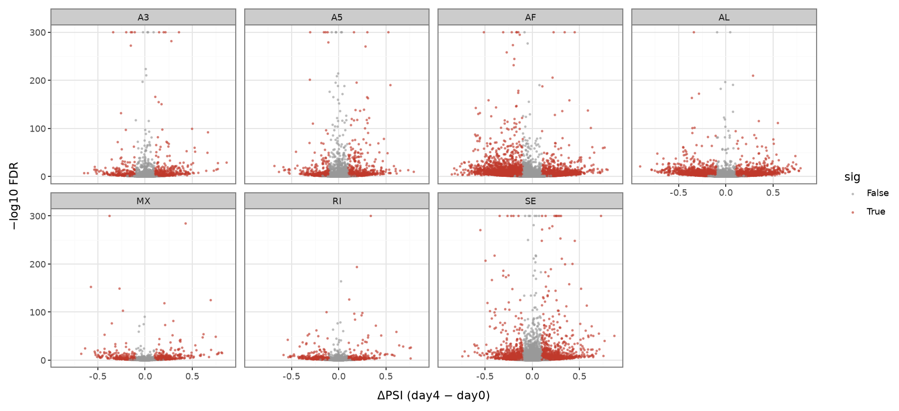 <em>ΔPSI vs FDR for SUPPA local events.</em>

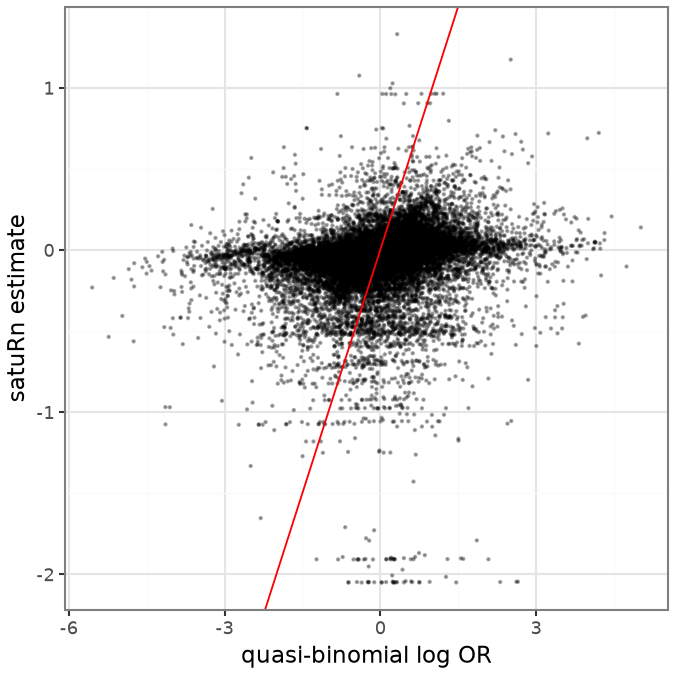 <em>Isoform-level effect sizes: closed-form quasi-binomial vs satuRn.</em>

satuRn agrees on isoforms with ≥ 5% usage (Spearman 0.88, n = 43,479). With its regular FDR, 4,495 of 4,608 quasi-binomial calls are also significant; with its empirical-null FDR, 2,712 isoforms in 1,900 genes, all within the quasi-binomial set. For rare isoforms (&lt; ~1% usage) satuRn returns near-constant estimates with very small standard errors; these are excluded by the ΔPSI filter.

<h2 id="biology">Known biology examples</h2>

PSI per cell is sparse (a few reads per event), so the UMAP shows PSI smoothed over each cell's gene-expression kNN neighbourhood: (Σ inclusion reads) / (Σ event reads) over the cell and its neighbours.

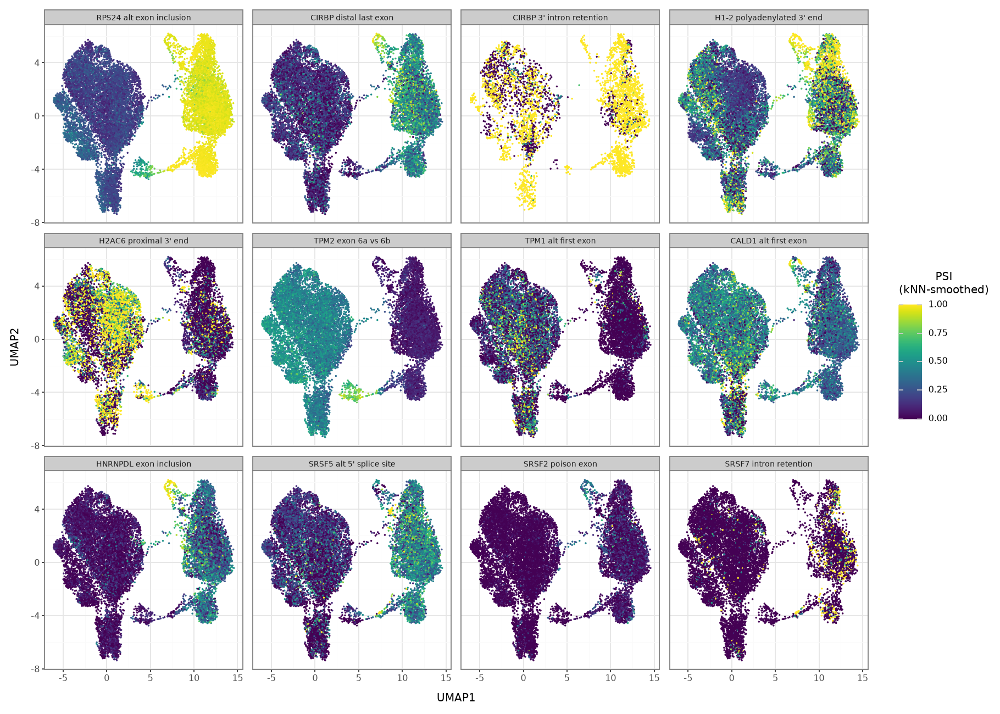 <em>kNN-smoothed PSI on the gene-expression UMAP (day 0 left cluster, day 4 right).</em>

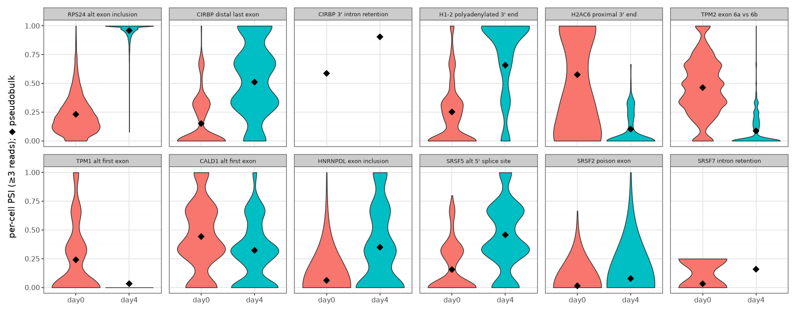 <em>Per-cell PSI for cells with ≥ 3 event reads; diamonds are pseudobulk PSI per day.</em>

<table class="dataframe tbl">
  <thead>
    <tr style="text-align: right;">
      <th></th>
      <th>PSI day0</th>
      <th>PSI day4</th>
      <th>ΔPSI</th>
      <th>total_reads day0</th>
      <th>total_reads day4</th>
    </tr>
    <tr>
      <th>event</th>
      <th></th>
      <th></th>
      <th></th>
      <th></th>
      <th></th>
    </tr>
  </thead>
  <tbody>
    <tr>
      <th>RPS24 alt exon inclusion</th>
      <td>0.231</td>
      <td>0.959</td>
      <td>0.729</td>
      <td>322673</td>
      <td>280826</td>
    </tr>
    <tr>
      <th>CIRBP distal last exon</th>
      <td>0.150</td>
      <td>0.511</td>
      <td>0.361</td>
      <td>7743</td>
      <td>4018</td>
    </tr>
    <tr>
      <th>CIRBP 3' intron retention</th>
      <td>0.587</td>
      <td>0.904</td>
      <td>0.318</td>
      <td>104</td>
      <td>115</td>
    </tr>
    <tr>
      <th>H1-2 polyadenylated 3' end</th>
      <td>0.252</td>
      <td>0.658</td>
      <td>0.406</td>
      <td>12092</td>
      <td>2264</td>
    </tr>
    <tr>
      <th>H2AC6 proximal 3' end</th>
      <td>0.576</td>
      <td>0.102</td>
      <td>-0.474</td>
      <td>1209</td>
      <td>1403</td>
    </tr>
    <tr>
      <th>TPM2 exon 6a vs 6b</th>
      <td>0.463</td>
      <td>0.087</td>
      <td>-0.376</td>
      <td>49488</td>
      <td>25713</td>
    </tr>
    <tr>
      <th>TPM1 alt first exon</th>
      <td>0.241</td>
      <td>0.033</td>
      <td>-0.208</td>
      <td>2818</td>
      <td>1512</td>
    </tr>
    <tr>
      <th>CALD1 alt first exon</th>
      <td>0.443</td>
      <td>0.323</td>
      <td>-0.120</td>
      <td>6137</td>
      <td>5245</td>
    </tr>
    <tr>
      <th>HNRNPDL exon inclusion</th>
      <td>0.062</td>
      <td>0.350</td>
      <td>0.288</td>
      <td>12722</td>
      <td>4422</td>
    </tr>
    <tr>
      <th>SRSF5 alt 5' splice site</th>
      <td>0.156</td>
      <td>0.457</td>
      <td>0.301</td>
      <td>4170</td>
      <td>3564</td>
    </tr>
    <tr>
      <th>SRSF2 poison exon</th>
      <td>0.014</td>
      <td>0.078</td>
      <td>0.064</td>
      <td>15719</td>
      <td>4306</td>
    </tr>
    <tr>
      <th>SRSF7 intron retention</th>
      <td>0.032</td>
      <td>0.159</td>
      <td>0.126</td>
      <td>1017</td>
      <td>151</td>
    </tr>
  </tbody>
</table>

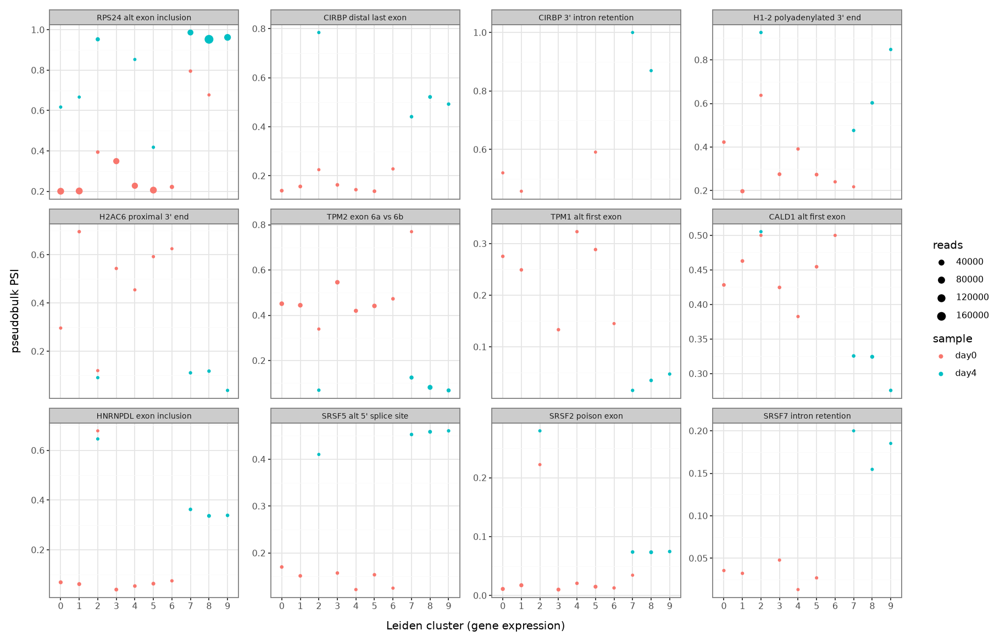 <em>Pseudobulk PSI per Leiden cluster (≥ 20 reads), coloured by day. Tests whether shifts are uniform across subpopulations.</em>

<b>CIRBP</b>: shifts from the proximal last exon to downstream alternative last exons and retains its 3′-proximal intron more at day 4. Temperature-dependent splicing / 3′ processing of Cirbp is documented (Gotic et al. 2016, Genes Dev), so this is a positive control for the 33.5 → 39.5 °C shift, alongside the 13-fold drop of RBM3.

<b>SR proteins</b>: SRSF2 poison exon, SRSF5 alternative 5′ site, SRSF7 intron retention and HNRNPDL exon inclusion move together toward NMD-associated forms, while spliceosome genes go down. This fits temperature-controlled CLK/SR protein activity (Haltenhof et al. 2020, Mol Cell) and/or lower splicing demand in arrested cells. Leiden cluster 2 (a small GADD45A/PTTG1-high population, 142 day 4 and 26 day 0 cells) has the highest SRSF2 poison-exon and HNRNPDL inclusion in both days, so these events also track a stress state, not only the day.

<b>Histones</b>: replication-dependent H1-2 and H2AC6 switch toward polyadenylated 3′ ends, expected when cells leave S phase.

<b>Cytoskeleton</b>: TPM2 exon 6a/6b, TPM1 and CALD1 alternative first exons switch, consistent with the move from proliferating to matrix-producing cells.

<b>RPS24</b>: inclusion of its short alternative exon rises from 23% to 96% (event PSI). The largest change in the data; whether it is driven by temperature or differentiation is not resolved.

<h3>Isoform structures</h3>

Top isoforms (by usage) per gene with pseudobulk usage per day; exon fill shows Δ usage (day 4 − day 0). Introns are compressed.

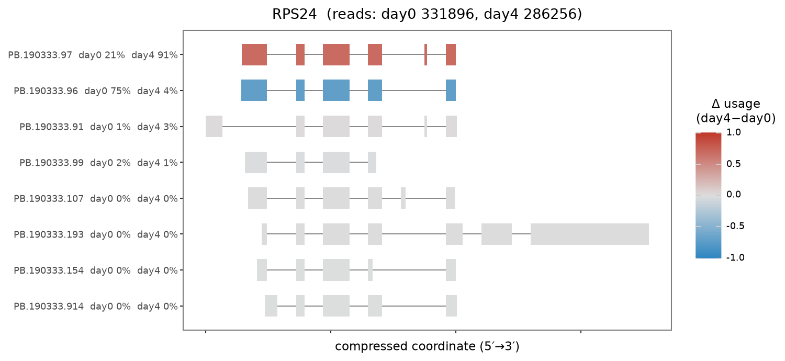 <em>RPS24</em>

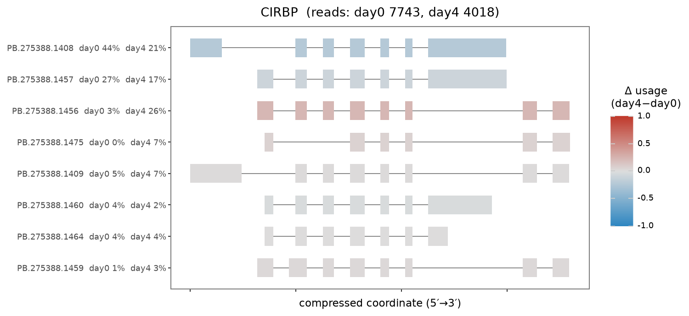 <em>CIRBP</em>

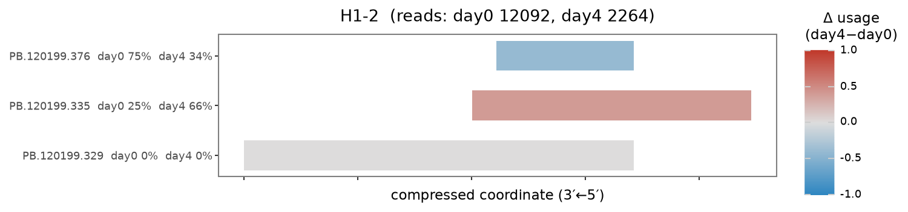 <em>H1-2</em>

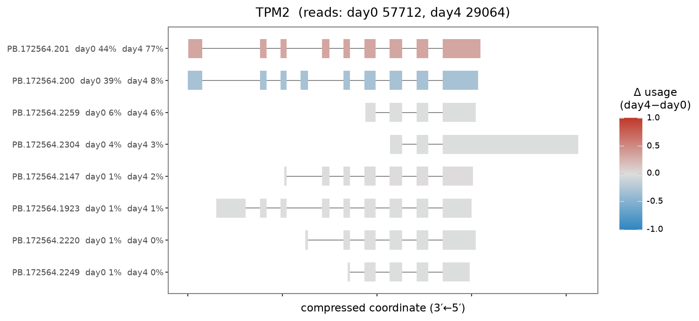 <em>TPM2</em>

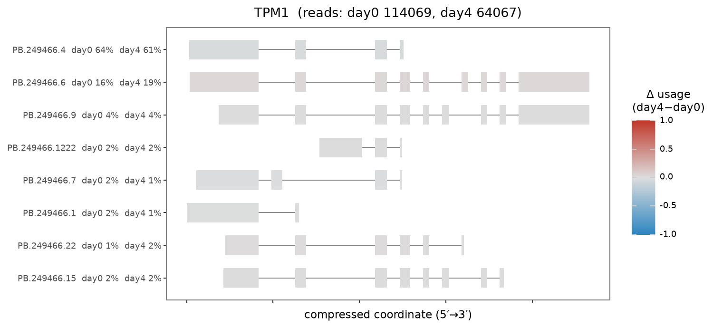 <em>TPM1</em>

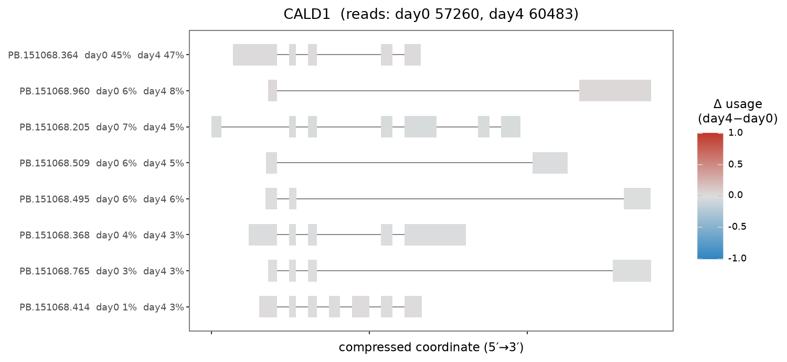 <em>CALD1</em>

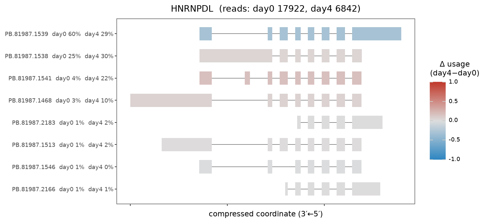 <em>HNRNPDL</em>

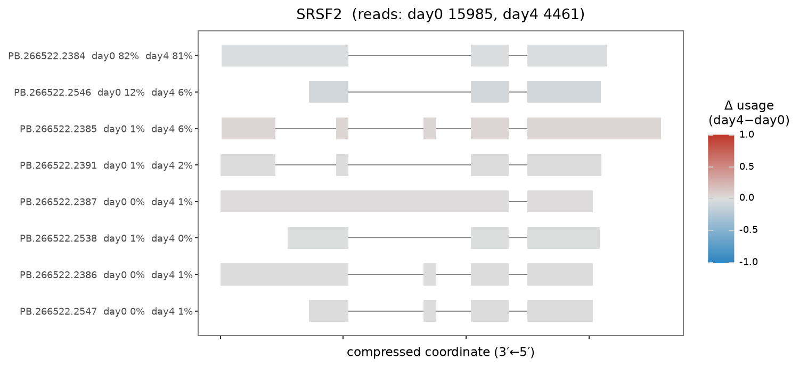 <em>SRSF2</em>

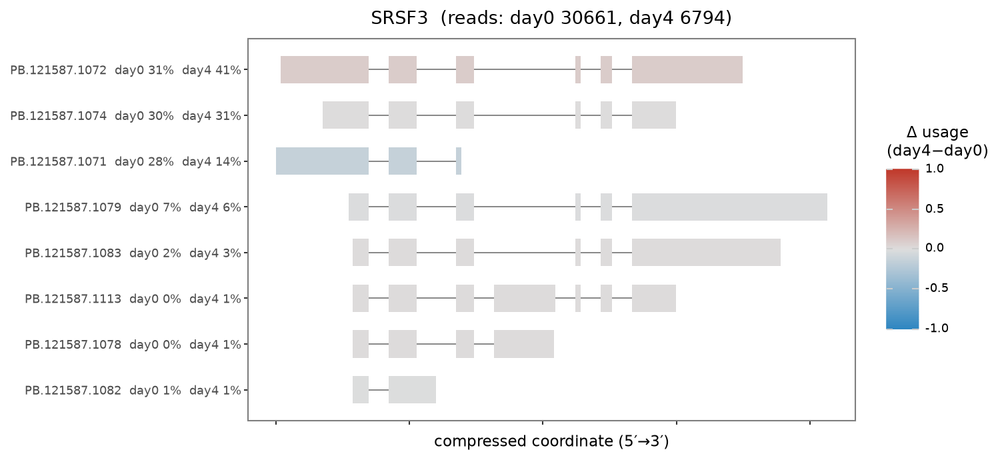 <em>SRSF3</em>

<h2 id="caveats">Caveats</h2>
<ul>
<li>One library per day: day is confounded with library and batch, and cells are not biological replicates. FDRs reflect cell-to-cell variability within one culture and are anti-conservative; effect sizes and biological consistency matter more.</li>
<li>Temperature and differentiation are confounded in this design; a 39.5 °C non-differentiating control would separate them.</li>
<li>Gene counts are built from pigeon-filtered isoforms, which drops ~40% of reads (mainly intra-priming).</li>
</ul>
